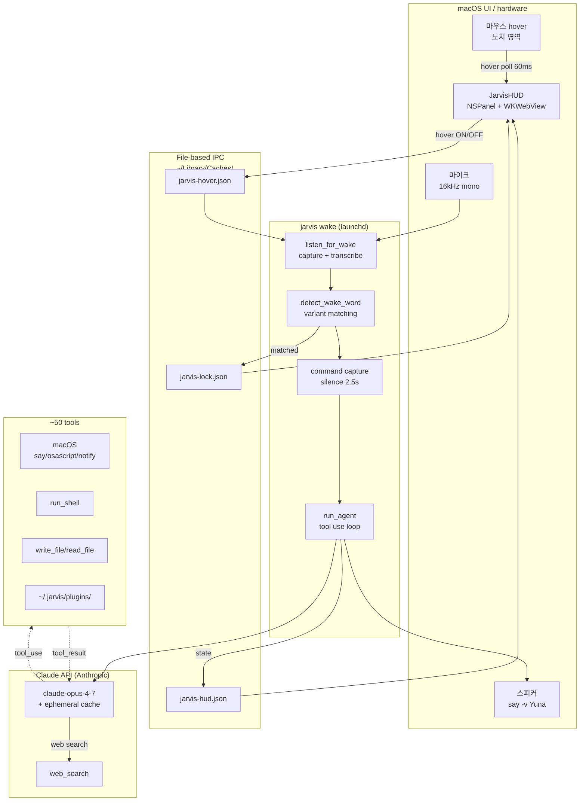

# 자비스 아키텍처

## 데이터 흐름 (wake mode)



## 모듈 구성

```
src/jarvis/
├── cli.py              # typer CLI (ask/do/wake/init/doctor/...)
├── config.py           # pydantic-settings + .env + ~/.jarvis/config.toml
├── assistant.py        # JarvisAssistant — 단발 + stream 응답
├── agent.py            # tool-use 에이전트 루프
├── persona.py          # 시스템 프롬프트 (jarvis/casual/formal/creative)
├── history.py          # ~/.jarvis/history.jsonl
├── hud.py              # state 파일 쓰기 (jarvis-hud.json)
├── health_server.py    # localhost /healthz
├── daemon.py           # launchd plist 관리
├── plugins.py          # ~/.jarvis/plugins/ 동적 import
├── voice/
│   ├── wake.py         # detect_wake_word + listen_for_wake
│   ├── recorder.py     # capture_phrase / record_until_silence
│   └── transcribe.py   # faster-whisper
└── tools/              # ~50 tools (macos/web/fs/...)

hud-overlay/Sources/JarvisHUD/main.swift   # NSPanel + WKWebView 시각화
```

## 상태 머신 (HUD 색상)

| 상태 | 색상 | 의미 |
|------|------|------|
| `idle` | 흰색 | 대기 |
| `listening` | 민트 (#7FFFD4) | wake word 또는 명령 받는 중 |
| `analyzing` | 노랑 (#FFD700) | LLM 처리 / 도구 호출 |
| `speaking` | 주황 (#FF7B00) | 답변 출력 (TTS) |

## Wake mode 트리거 시퀀스

1. 마우스 노치 영역 1초 hover → HUD `expand()` → `hover.json hover=true`
2. Daemon `_is_hover_active() == true` → `capture_phrase` 시작
3. 발화 감지 → 0.3초 침묵 → 전사 (tiny 모델, ~0.1s)
4. wake word 매칭 (다양한 변종 + JARVIS_WAKE_WORD)
5. 매칭 시 `lock.json lock=true` → HUD 강제 유지
6. ack TTS (비동기) → command capture (silence 2.5s, max 25s)
7. `run_agent` → tool use 루프 → 답변 TTS
8. EXIT_KEYWORDS ("꺼져" 등) → `lock=false` → HUD collapse, daemon 다시 hover 대기

## 캐싱 전략

- Claude API: `system` 블록과 `tools` 마지막에 `cache_control: ephemeral` (5분 TTL)
- HUD state: 1초 폴링 (저빈도)
- Hover: 60ms 폴링 (반응성)
- Transcribe 모델: detect=tiny (빠름), command=small (정확도)

## 확장 모듈

### LLM Provider 추상화 (`providers.py`)

`JARVIS_PROVIDER` 환경변수로 backend 전환:

| Provider | Tool use | 비고 |
|----------|----------|------|
| `anthropic` (기본) | ✅ | 모든 기능. `wake`/`do` 권장 |
| `openai` | 🟡 (chat-only 구현) | `OPENAI_API_KEY` 필요 |
| `ollama` | ❌ | 로컬, `JARVIS_MODEL=llama3.2` |

### Vector Memory (`memory_store.py`)

ChromaDB 기반 영구 vector store. `~/.jarvis/vectorstore/`. LLM tool로 노출:
- `memory_save(text, source)` — sha256 ID 기반 dedup
- `memory_recall(query, limit)` — 유사도 검색 (1/(1+dist) score)
- `memory_count()` — 총 문서 수

### Web Dashboard (`health_server.py`)

`http://localhost:41418/` (점유 시 41419~41430 자동 폴백)
- `/` — HTML dashboard (2초 자동 새로고침)
- `/healthz` — JSON status
- `/tools` — 등록 tool 목록
- `/history?n=N` — 최근 conversation
- `/metrics` — 시스템 metrics (CPU/MEM)

### Plugin Marketplace

`jarvis plugin install <github-url>` — repo의 `plugin.py` / `<repo>.py` 자동 감지 → `~/.jarvis/plugins/`. 사용자 확인(y/N) 후 설치.
